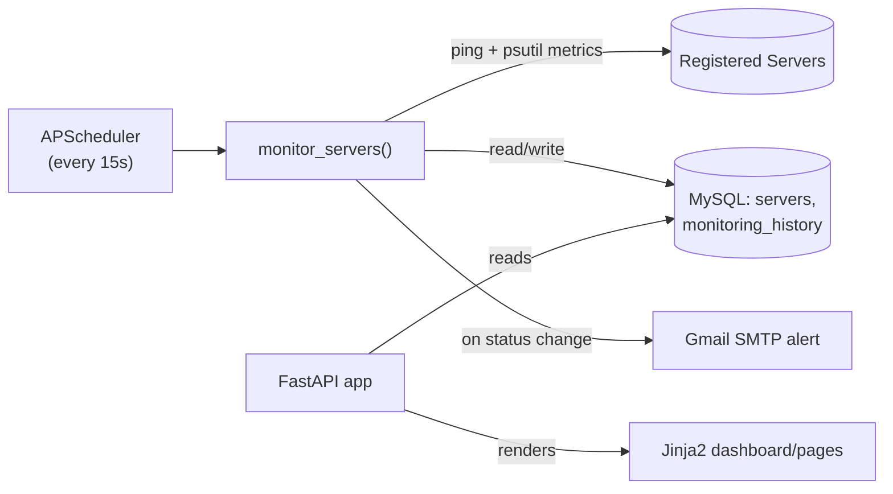

# InfraPulse

> **Status: Archived / decommissioned.** Kept as a portfolio reference; not actively maintained or deployed.

A self-hosted infrastructure monitoring dashboard built with FastAPI. It periodically pings a list of registered servers, records CPU/memory/disk metrics, tracks status changes (Online / Warning / Critical) in a MySQL database, and emails an alert when a server's status changes.

## Features

- **Server inventory** — register servers with hostname, IP, OS type, environment, and owner
- **Background monitoring** — a scheduled job (APScheduler) pings every server and collects system metrics every 15 seconds
- **Status tracking** — Online/Warning/Critical status per server, with per-server pause/resume of monitoring
- **Alert history** — every status transition is logged to a `monitoring_history` table
- **Email alerts** — sends an email via Gmail SMTP when a server's status changes
- **Dashboard UI** — server-rendered HTML views (dashboard, server list, monitoring, alerts, reports, settings) via Jinja2 templates

## Architecture



## Tech stack

- **Backend**: FastAPI, Uvicorn
- **Scheduling**: APScheduler
- **Metrics**: psutil
- **Database**: MySQL via SQLAlchemy + PyMySQL
- **Templates**: Jinja2
- **Config**: python-dotenv (environment variables)

## Setup

### 1. Install dependencies

```bash
pip install -r requirements.txt
```

### 2. Configure environment variables

Copy the example file and fill in real values:

```bash
cp .env.example .env
```

`.env` (git-ignored, never commit this):

```
DATABASE_URL=mysql+pymysql://<user>:<password>@localhost/infrapulse
SMTP_SENDER_EMAIL=<your-email@gmail.com>
SMTP_APP_PASSWORD=<gmail-app-password>
```

`SMTP_APP_PASSWORD` must be a [Gmail App Password](https://myaccount.google.com/apppasswords), not your regular account password.

### 3. Database schema

Create a MySQL database named `infrapulse` with two tables:

- `servers` — id, hostname, ip_address, os_type, environment, owner, status, monitoring_enabled, cpu_usage, memory_usage, disk_usage, last_checked
- `monitoring_history` — id, server_id, hostname, old_status, new_status, event_time

### 4. Run

```bash
uvicorn backend.main:app --reload
```

Visit `http://localhost:8000`.

## Security note

This project previously had a database password and a Gmail App Password committed directly in source (`backend/database/connection.py` and `backend/services/email_service.py`). Both have been moved to environment variables loaded from a git-ignored `.env` file. If you fork or reuse this code, generate your own fresh credentials — do not reuse any value that may have appeared in this repository's history.

## Why it's archived

This was a learning project to practice FastAPI, background job scheduling, and basic infrastructure monitoring concepts. It's no longer deployed or maintained, but the code is kept here as a portfolio reference.
